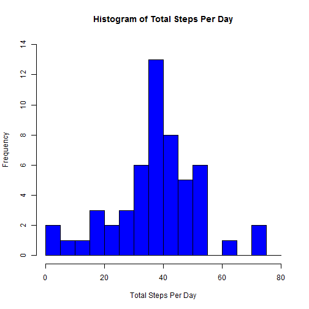
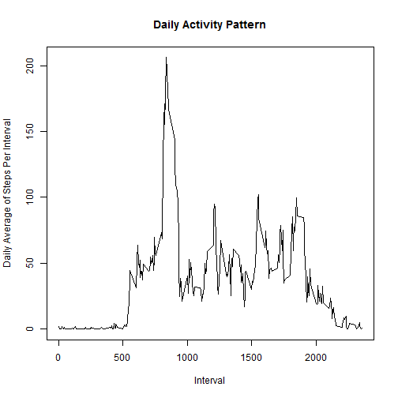
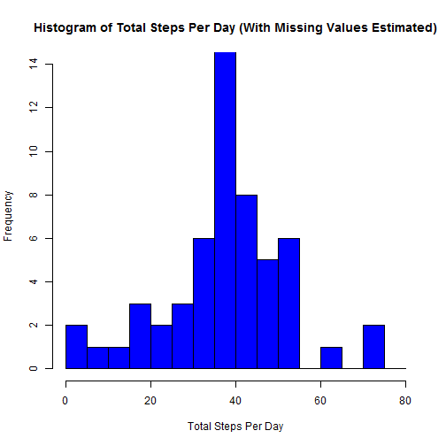
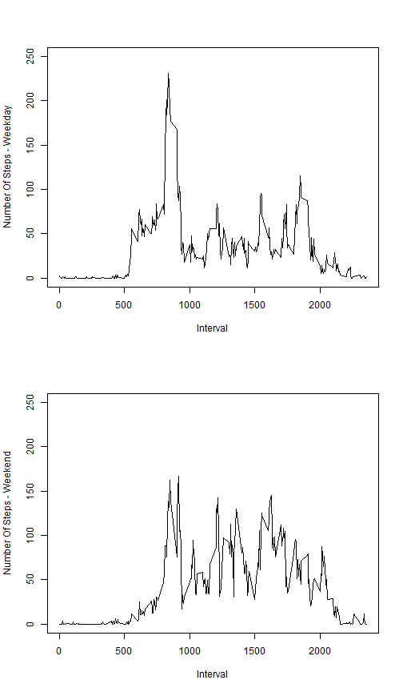

## Loading and preprocessing the data

```r
df = read.csv(file="activity.csv")
```


## What is mean total number of steps taken per day?

```r
totals <- aggregate(x=df$steps, by=list(df$date), FUN=mean, na.rm=TRUE)

hist(totals$x, breaks=seq(from=0,to=80,by=5), xlab="Total Steps Per Day", ylab="Frequency", main="Histogram of Total Steps Per Day", col="blue", ylim=c(0,14))
```

 

```r
totals.mean <- mean(totals$x, na.rm=TRUE)

totals.median <- median(totals$x, na.rm=TRUE)
```

The mean total number of steps taken per day is 37.3825996 steps.
The median total number of steps taken per day is 37.3784722 steps.

## What is the average daily activity pattern?

```r
avgs <- aggregate(x=df$steps, by=list(df$interval), FUN=mean, na.rm=TRUE)

names(avgs) <- c("interval","steps")

plot(x=avgs$interval, y=avgs$steps, xlab="Interval", ylab="Daily Average of Steps Per Interval", main="Daily Activity Pattern", type="l")
```

 

```r
avgMaxInterval <- avgs$interval[ which(avgs$steps == max(avgs$steps, na.rm=TRUE))]
```

The 835 interval is the 5-minute interval having the max average value across all days.

## Imputing missing values

```r
missing <- is.na(df$steps)

sumMissing <- sum(missing)

index <- match(df$interval, avgs$interval)

df.complete <- df

df.complete$steps[missing] <- avgs$steps[ index[missing] ]

totals.complete <- aggregate(x=df.complete$steps, by=list(df.complete$date), FUN=mean, na.rm=TRUE)

hist(totals.complete$x, breaks=seq(from=0,to=80,by=5), xlab="Total Steps Per Day", ylab="Frequency", main="Histogram of Total Steps Per Day (With Missing Values Estimated)", col="blue", ylim=c(0,14))
```

 

```r
totals.complete.mean <- mean(totals.complete$x, na.rm=TRUE)

totals.complete.median <- median(totals.complete$x, na.rm=TRUE)
```
In the original dataset there were 2304 missing values. A "complete" dataset was created by copying the original dataset and filling in missing by using the mean per the interval across all days.

The mean total number of steps taken per day after filling in missing values is 37.3825996 steps.
The median total number of steps taken per day after filling in missing values is 37.3784722 steps.

The mean and median based on the completed dataset do not differ from the mean and median of the original dataset. There is no impact of imputing missing on these estimates.


## Are there differences in activity patterns between weekdays and weekends?

```r
weekdays <- weekdays(as.POSIXct(df$date))

DateType <- factor( ifelse(grepl("Sunday|Saturday",weekdays), "weekend", "weekday"))

df.complete <- cbind(df.complete, DateType)

weekdayAvg <- aggregate(df.complete$steps[ df.complete$DateType == "weekday"], by=list(df.complete$interval[ df.complete$DateType == "weekday"]), FUN=mean, na.rm=TRUE)

names(weekdayAvg) <- c("interval","steps")

weekendAvg <- aggregate(df.complete$steps[ df.complete$DateType == "weekend"], by=list(df.complete$interval[ df.complete$DateType == "weekend"]), FUN=mean, na.rm=TRUE)

names(weekendAvg) <- c("interval","steps")

par(mfrow=c(2,1))
plot(x=weekdayAvg$interval, y=weekdayAvg$steps, xlab="Interval", ylab="Number Of Steps - Weekday", type="l", ylim=c(0,250))
plot(x=weekendAvg$interval, y=weekendAvg$steps, xlab="Interval", ylab="Number Of Steps - Weekend", type="l", ylim=c(0,250))
```

 


Based on the plot outputs, there is a difference in weekday activity versus weekend activity. Noticeably, there is more activity throughout the day on the weekends (although it doesn't start as early, or peak as high, as the weekday).
